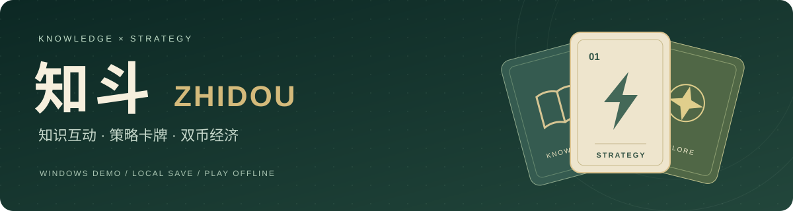
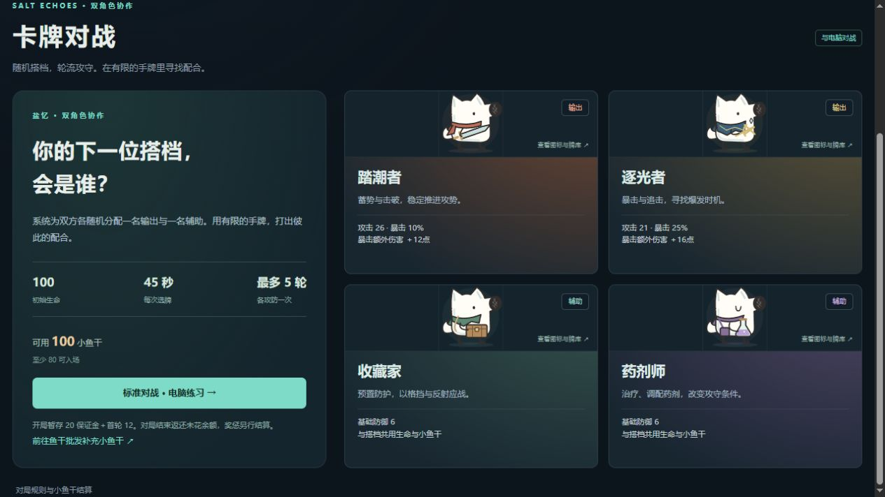

<p align="center"></p>

<p align="center"><strong>把知识互动，变成可以亲手体验的策略卡牌世界。</strong><br><sub>A knowledge-community and strategy-card prototype with a playable local demo.</sub></p>

<p align="center">
  <a href="https://github.com/ilovemiku520/zhidou-hackathon-demo/releases/tag/desktop-v0.7.0"></a>
  <a href="#download"></a>
  <a href="#play"></a>
  <a href="https://github.com/ilovemiku520/zhidou-hackathon-demo/stargazers"></a>
</p>

<p align="center"><a href="#download"><strong>下载试玩</strong></a> · <a href="#features">核心玩法</a> · <a href="#preview">界面预览</a> · <a href="#documentation">产品材料</a> · <a href="#development">源码构建</a></p>

> **使用须经书面许可：** 保留所有权利。完整条款见 [LICENSE](LICENSE)。

知斗是一款面向知乎生态的**知识互动与策略卡牌产品原型**。以活力币和小鱼干串联日常参与、随机报价交易、卡牌对战、关卡探索与战报复盘，让产品规则成为可操作的体验。

**本仓库提供 Windows 免安装本地演示。** 免登录、无需云服务器、单份本地存档，核心玩法可离线体验。桌面工具是本次参赛的演示载体，产品定位与今后的接入形式不受此限定。

<a id="preview"></a>
## 界面预览



<sub>截图来自公开仓库 0.7.0 源码的本地构建，展示本地试玩状态；试玩资产不对应真实财产或官方权益。</sub>

<a id="download"></a>
## 下载即玩

<p><a href="https://github.com/ilovemiku520/zhidou-hackathon-demo/releases/download/desktop-v0.7.0/zhidou-demo-windows-x64.zip"></a></p>

| 准备 | 操作 |
|---|---|
| **1 · 下载** | 获取上面的 `zhidou-demo-windows-x64.zip`。[发布页](https://github.com/ilovemiku520/zhidou-hackathon-demo/releases/tag/desktop-v0.7.0) · [SHA256 校验文件](https://github.com/ilovemiku520/zhidou-hackathon-demo/releases/download/desktop-v0.7.0/SHA256SUMS.txt) |
| **2 · 解压** | 完整解压到可写目录，建议放在 D 盘；不要直接在压缩包中运行。 |
| **3 · 启动** | 双击 **“开始试玩.cmd”**，浏览器将打开本机演示页面。 |

适用于 **Windows 10 / 11 64 位**，建议使用 Chrome 或 Edge。演示包包含运行组件，无需安装 Node.js、Python 或浏览器扩展，也无需管理员权限或测试账号。

> GitHub 自动生成的 **Source code** 压缩包仅含源码，不是免安装试玩包。安装、存档和排错详见[演示工具运行说明](desktop/README.md)。

<a id="features"></a>
## 核心玩法

| 双币经济 | 卡牌策略 |
|---|---|
| **日常任务与奖励**：签到、阅读、对战获得试玩资源。 | **标准对战**：随机搭档、卡牌费用、攻防选择与胜负结算。 |
| **鱼干批发**：每日随机报价，体验买入、持有、卖出与盈亏。 | **关卡与隐藏 Boss**：挑战两个关卡，在示例题单中探索暗黑看山。 |
| **钱包与记录**：查看资产、交易明细、订单与本地进度。 | **战报与统计**：终局复制阵容、关键出牌和结果，查看本地战术统计。 |

暗黑看山在示例题单中为每份存档独立随机选定藏身位置，探索免费，找到后解锁挑战。战报由玩家自行决定是否分享。

<a id="play"></a>
## 第一次试玩路线

1. **领取资源**：签到领取活力币；需要更多试玩资源时，可使用直接开放的开发者工具。
2. **体验交易**：进入鱼干批发，观察报价并尝试买卖小鱼干。
3. **打一局牌**：用随机搭档挑战电脑，体验卡费、攻防与胜负收支。
4. **探索与复盘**：挑战关卡、寻找隐藏 Boss，结束后复制战报并查看本地统计。
5. **保存退出**：打开“试玩说明”，点击 **“保存并退出”**；只关闭浏览器不会结束本机进程。

存档位于解压目录的 `data/zhidou-demo.sqlite`。重新启动可以继续；升级前先退出并保留 `data` 目录。重置操作会清空当前试玩进度。

## 当前演示与产品规划

演示已实现本地交易、钱包、任务、卡牌、关卡、隐藏 Boss、彩蛋码与战报统计。**真实知乎回答核验、用户间打赏、官方活动发码与礼品权益、真人匹配、OAuth 和知乎 AI 复盘尚未接入。**

联网时可读取活动官方公开知识，离线提供原创玩法读本。示例题单不是实时热榜，本地战术统计不是知乎 AI 复盘。

<details>
<summary><strong>展开完整功能状态表</strong></summary>

| 模块 | 完整产品设计 | 当前演示 |
|---|---|---|
| 日常与贡献奖励 | 签到、阅读、回答、有效互动领取活力币；优质回答获得小鱼干 | 签到、阅读、对战任务可操作；真实贡献核验待接入 |
| 鱼干批发 | 每日概率报价，双向买卖、持有盈亏、费用与额度 | 可操作，含七日折线、订单与交易累计盈亏 |
| 社区打赏 | 任何读者都可用小鱼干支持答主，无需达到系统奖励门槛 | 已设计转账流程，未接入真实答主钱包 |
| 活动兑换码 | 参与官方活动后领码，按账户与批次限领并核销到账 | 本项目彩蛋码流程可操作；官方活动发码待接入 |
| 官方礼品兑换 | 头像框、称号、小礼品；价格、库存、发放与退款 | 完整商品流程保留在方案中，未发放真实权益 |
| 卡牌与Boss | 随机搭档、卡费与胜负收支、两个关卡、个人每日热榜探索 | 对战与奖惩可操作；隐藏Boss使用示例题单 |
| 钱包和财富榜 | 双币估值、分项收支、总资产前100名 | 本地资产与交易、对战收支可查看；多人榜待接入 |
| 战报与复盘 | 可复制战术素材，知乎AI辅助复盘，用户自行分享 | 本地战报与统计可操作，未调用AI复盘 |

产品说明详细介绍了打赏、官方活动和礼品设计，未接入的部分保留为完整产品规划。单机演示免登录，可直接调币并保存进度；联网时可读活动官方知识，离线有原创玩法读本。桌面运行方式不改变知斗的产品定位。

</details>


<a id="documentation"></a>
## 产品材料

| 文档 | 适合了解 |
|---|---|
| [产品说明计划书](docs/产品说明计划书.md) · [Word 下载](https://github.com/ilovemiku520/zhidou-hackathon-demo/releases/download/desktop-v0.7.0/zhidou-product-plan.docx) | 创作思路、知乎生态价值、体验流程、完整规则与后续计划 |
| [演示工具运行与试玩](desktop/README.md) | 运行环境、启动、离线体验、存档与排错 |
| [卡牌表](docs/卡牌表.md) · [世界观与角色](docs/世界观与角色.md) | 卡牌与角色设计 |
| [暗黑看山降临机制](docs/暗黑看山降临机制.md) | 候选题单、个人随机位置、提示与探索入口 |
| [参赛提交说明](docs/参赛提交说明.md) | 演示包、产品说明和代码仓库的交付状态 |

参赛交付包含安装包、产品说明计划书与代码仓库，不含视频。本仓库是独立公开参赛版本。

<a id="development"></a>
## 开发与构建

<details>
<summary><strong>从源码构建 Windows 演示包</strong></summary>

开发环境使用 **Node.js 22.17.1 或更新的 22.x 版本**。

```bash
git clone https://github.com/ilovemiku520/zhidou-hackathon-demo.git
cd zhidou-hackathon-demo/desktop
npm ci
npm run build
```

Windows 默认输出到 `D:/知斗测试/知斗demo演示文件`。可用 `ZHIDOU_DESKTOP_OUTPUT` 指定输出目录、`ZHIDOU_NODE_DIR` 指定 Windows Node.js 运行时目录。完整要求与构建说明见 [desktop/README.md](desktop/README.md)。

```bash
npm test
```

该命令验证本地 HTTP 边界、存档及核心操作。构建复用 `site` 中的页面和规则，无需原网站部署依赖或 API 密钥。

</details>

| 目录 | 内容 |
|---|---|
| `desktop/` | 本地运行、构建、启动与验证 |
| `site/src/` | 共享规则、对战及状态处理 |
| `site/public/` | 页面、样式、交互与卡牌素材 |
| `docs/` | 产品设计、玩法、参赛说明与交付材料 |

## 素材与运行组件

刘看山形象及相关标识属于原权利方，相关设计用于活动演示；后续使用需确认授权范围。公开源码不代表对第三方形象授予再许可。Node.js 及其所含第三方许可随演示包保留。详见 [NOTICE.md](NOTICE.md)。

<a id="usage-notice"></a>
## 使用声明与作者

<details>
<summary><strong>展开完整中英文使用与 AI 使用声明</strong></summary>

<!-- BEGIN RIGHTS NOTICE -->
## 版权与使用限制 / Copyright and use restrictions

**保留所有权利。未经著作权人事先书面许可，不得使用、运行、复制、修改或分发本项目受保护的原创内容，包括个人、学习、研究、非商业和商业用途，以及依法需要许可的 AI 使用。**

**All rights reserved. Prior written permission is required to use, run, copy, modify or distribute the project's protected original material, including personal, educational, research, non-commercial and commercial use, and AI use where permission is required by law.**

完整条款见 [LICENSE](LICENSE)。第三方内容仍适用其各自许可；此前已授予的许可、法定权利及 GitHub 平台条款项下权利不受影响。本文中的安装、运行及开发说明仅为技术说明，不构成使用授权。

See [LICENSE](LICENSE) for the full terms. Third-party licenses, previously granted permissions, statutory rights and rights under GitHub's Terms of Service remain unaffected. Setup, usage and development instructions are technical documentation, not permission to use the material.

书面授权 / Permission requests: [ilovemiku520@outlook.com](mailto:ilovemiku520@outlook.com)

关注初音未来谢谢喵，ilovemiku520  
Please follow Hatsune Miku, thank you, meow. ilovemiku520
<!-- END RIGHTS NOTICE -->

</details>


<p align="center">关注初音未来谢谢喵，ilovemiku520<br><sub>Please follow Hatsune Miku, thank you, meow. ilovemiku520</sub></p>
<p align="center"><a href="https://github.com/ilovemiku520/zhidou-hackathon-demo/issues">反馈问题</a> · <a href="https://github.com/ilovemiku520">@ilovemiku520</a></p>
